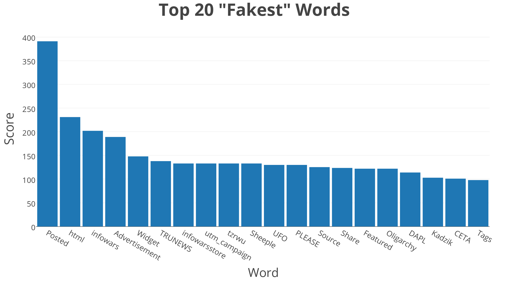

# amaisel-BDAorg

#### Name: Alex Maisel
#### Major/Year: MPS, Statistics

My name is Alex Maisel, and I am an MPS Student in Applied Statistics here at Cornell. I also completed my undergraduate degree here, which was in Statistical Science. Last semester, I was dual-enrolled in my bachelor's and MPS programs, but now I am a full-time matriculated MPS Student!

My main interest in this course, and in statistics more generally, is learning how to apply rigorous scientific and statistical methods to issues in social science and especially in politics. As a member of the Cornell International Affairs Society (CIAS), I have spent the last several years discussing political issues at a qualitative level, but it is clear to me that the field lacks the rigorous numerical underpinnings that I and many others prefer. With that in mind, the current topic of interest to me is a piece of media I read recently in Open Data Science (ODSC), a semi-political resource for aspiring statisticians and data scientists.  

The piece of interest, "On Building a "Fake News" Classification Model" attempts to use basic natural language processing, as well as a Naive Bayes (!!!) Classifier to detect whether or not an article is an example of real, or factual news, or the infamous "fake news" that has become a part of modern political discourse. This happened based on a Kaggle dataset of 13,000 articles that have been independently classified as fake or real news. I found this piece incredibly compelling because it applied modern statistical tools that I have learned and will continue to learn, to an issue that affects the world in profound and tangible ways. Because I have always been a bit of a politics junky, this is the application that most recently and most heavily caught my eye. I am excited to expand upon my statistics knowledge and knowledge of Bayesian statistics in particular, to help me answer questions such as this one. My hope is that one day soon, I can complete analyses similar to this one, and contribute to the current political discourse with objective, data-driven methodologies.

 